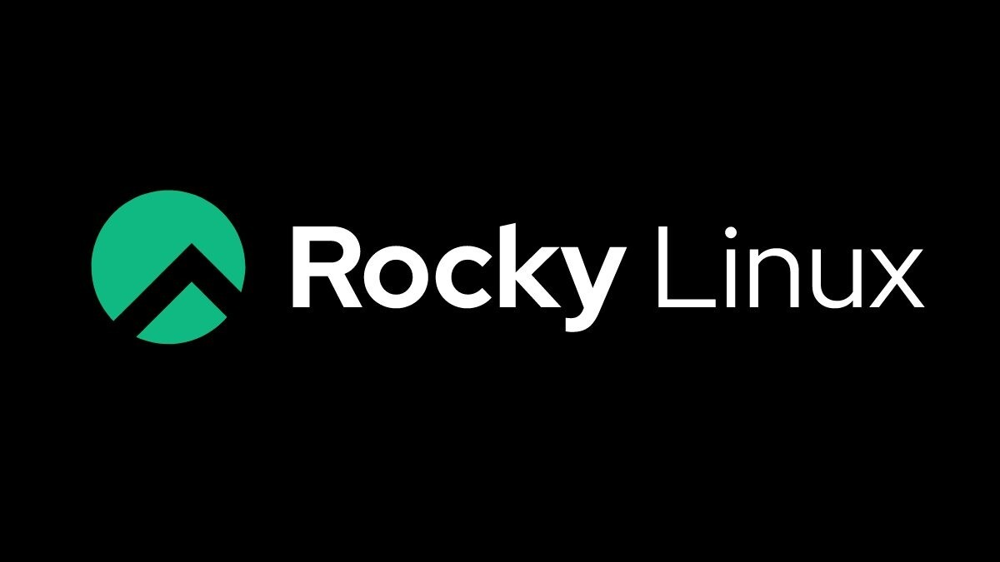

¿Que es Rocky Linux?

- Rocky Linux es una distribución de Linux, desarrollada por Rocky Enterprise Software Foundation. Está destinada para ser una distribución downstream, lanzada completamente para ser compatible con código binario usando el código de fuente del sistema operativo de Red Hat Enterprise Linux

